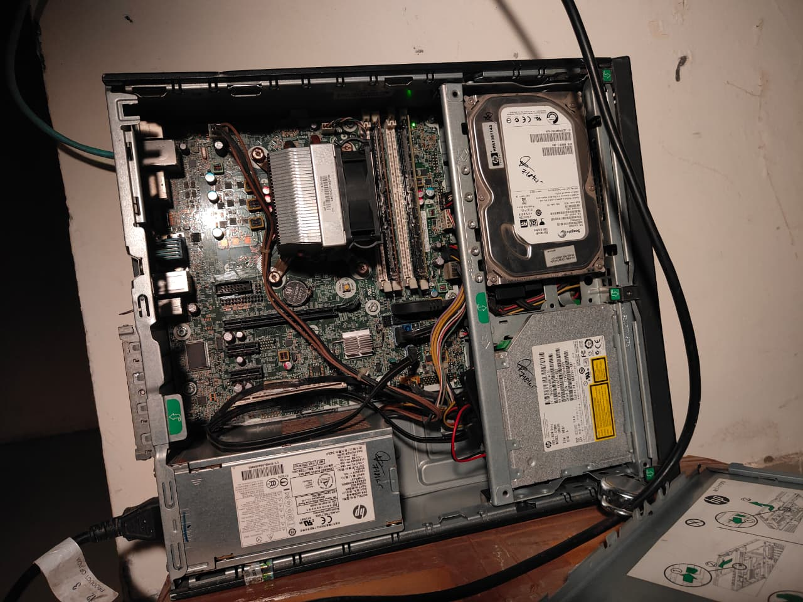

# My Homelab, My Rules  
### …and why it became the one place where everything finally feels *mine*
---

There's something romantic about a homelab.  
Not in the candle-light-dinner way — more like *"this is my little universe, running on wires and willpower."*

Mine wasn't built from money, or ambition, or some enterprise-grade rack server humming in a basement.

It started with **one freelance job** and a second-hand **HP EliteDesk 800 G1 SFF** — an aging i5 4th Gen, **8 GB of DDR3**, a **128 GB SSD**, and a **500 GB HDD** that had probably lived several lives before ending up with me.

Nothing fancy. Nothing expensive.  
Just enough.  
And enough is powerful when you actually know what you want.

### Some pictures of server seating in the corner



## **Why I Even Wanted a Homelab**  
---
I'm the kind of person who gets uncomfortable giving strangers my data — *especially* trillion-dollar strangers.  
Google Photos deciding the fate of my memories?  
A SaaS password manager holding my entire digital existence?  
Online tools storing my documents because I needed to compress a PDF?

No. Absolutely not.

I wanted a place that was:

- **Private**  
- **Cheap**  
- **Mine**  
- And **fun to break** without consequences.

Cloud services try to protect you from yourself.  
A homelab says, "Here's root access. Good luck."

That's my love language.

## **The Brain: Proxmox on Old Hardware**  
---
I wiped the machine, installed [**Proxmox**](https://www.proxmox.com/en/products/proxmox-virtual-environment/overview) directly on the **128 GB SSD** with ext4 (ZFS refused to boot on this grandpa system), and suddenly this dusty corporate PC became a **playground**.

A playground where I could break things, fix things, and rebuild things at 3 AM because I felt like it.

## **Nothing Is Public-Facing — And That's the Magic**  
---
People flex self-hosted setups with reverse proxies, DNS records, Cloudflare tunnels…

Cool setups, sure.  
But I didn't want the internet anywhere near my stuff.

So I built an isolated little universe:

- A **virtual network (10.20.30.0/24)**  
- A **virtual router (IPFire)**  
- A **virtual DNS (Pi-hole)**  
- A **VPN gatekeeper (NetBird)**  
- A **reverse-proxy layer (Traefik)**  
- DNS management via **Cloudflare**  

If I'm outside my house, I open NetBird, connect, and boom — I'm *inside* my homelab like I never left.

No exposed ports.  
No reverse proxy stress.  
No "rate-limited by Let's Encrypt."  
Just… peace.

### **The Network Diagram (My Tiny Internet)**
---


## **The Proxy Network — A Private Layer for User-Facing Apps**
---
To keep everything locked down and under *my* control:

- I created a dedicated Docker bridge network called **`proxy`** with subnet **192.168.204.0/24**.
- Every container that serves a UI or web service to *me* runs inside this network—Immich, Stirling-PDF, Vaultwarden, OmniTools, etc.
- **Traefik** is the only container exposed to the outer virtual network (10.20.30.0/24) via the Docker host. It handles all inbound routing, TLS termination, and service discovery.
- Internally, no other container has direct host-LAN exposure. Services communicate only via the `proxy` network and Traefik rule sets.
- External access is only via the VPN (NetBird). No public ports are exposed, no "open to the world" services.
- DNS is managed by **Cloudflare**, but the subdomains resolve only inside the VPN-linked environment.
- This architecture gives me:
  - Strong network isolation
  - Centralized, manageable ingress (Traefik)
  - Minimal attack surface
  - Control over service routing and TLS certs
  - Peace of mind

**In short**: everything user-facing is behind one gate. I hold the key.

## **The Services I Run (and Why They Matter to Me)**
---

### 1. [Immich](https://immich.app/) — My Photos, My Rules

Google Photos is convenient until it isn't.
Until they change a policy.
Until they lock an account.
Until your entire visual history depends on a corporation's mood.

Immich lives on my HDD.
No charges.
No compression.
No unknown eyes.

It's the first time my memories feel truly *mine*.

### 2. [Vaultwarden](https://github.com/dani-garcia/vaultwarden) — Passwords Shouldn't Live in Someone Else's Building

A local password manager hits different.

No breach headlines.
No tracking.
And it gives me **Bitwarden premium features (TOTP!)** without the premium price.

Self-hosting this was the moment I realised:

> "Privacy doesn't require money. Just intent."

### 3. [NetBird](https://netbird.io/) — My Portal Back Home

I love the feeling of opening NetBird on my phone miles away and suddenly being *inside* my homelab like I never left.

It's magic. WireGuard-powered magic.

### 4. [Traefik](https://traefik.io/) — The Entry Gate I Control

Traefik handles all the routing of services inside my virtual network. It dynamically discovers containers and maps domains internally, while I manage DNS via Cloudflare. It also manages TLS certificates via [Let's Encrypt](https://letsencrypt.org/), keeping everything secure without manual certificate juggling.

### 5. [Cloudflare](https://cloudflare.com/) DNS — Domain Management, My Terms

Instead of relying solely on dynamic IPs or exposing ports to the world, I use Cloudflare for DNS management. Cloudflare's protections let me keep things under my control without surrendering my data.

### 6. [n8n](https://n8n.io/) — Automation Without Asking Permission

Cloud automation tools treat you like a child:
"You've hit your free limit."
"You can run only X workflows."
"Upgrade to Pro."

n8n is like:

> "Do whatever you want, I don't care."

And I love that energy.

### 7. Obsync ([CouchDB](https://couchdb.apache.org/)) — My Obsidian, Synced Like a Superpower

There's an extension called ["Self-hosted LiveSync"](obsidian://show-plugin?id=obsidian-livesync) that syncs Obsidian via CouchDB.

I added a CouchDB Docker container.
Connected it.
And my notes sync faster than most paid sync services.

Also:
Zero cloud.
Zero tracking.
Zero dependency.

### 8. [OmniTools](https://omnitools.app/) — A Toolbox That Doesn't Sell My Files

Image converters.
Document compressors.
All local.
All private.

Because sending a passport scan to some random website just to make it 2 MB smaller always felt like a horror story waiting to happen.

### 9. [Stirling-PDF](https://github.com/Stirling-Tools/Stirling-PDF) — My Document Converter, My Terms

I recently hosted **Stirling-PDF**, an open-source PDF conversion/processing service. No external service. No hidden tracking. If I need to generate or convert PDFs, it happens in my domain, controlled by me.

## **Subdomains? Yes. Public? Never.**
---
I use private DNS names like:

```
immich.pve.razobeckett.xyz  
vaultwarden.pve.razobeckett.xyz  
pihole.pve.razobeckett.xyz
stirling-pdf.pve.razobeckett.xyz
```

They resolve *only* inside the NetBird network (and via internal DNS + Traefik) and through Cloudflare-managed DNS. From the outside world, these domains don't even exist.

## **Why This Homelab Means So Much to Me**
---
It wasn't built with expensive hardware.
It wasn't built with enterprise gear.
It wasn't built because I "needed" it.

It was built because:

* I wanted to own my data
* I wanted to learn
* I wanted to break things without consequences
* And because it feels good knowing your world runs on your terms

Most people chase the cloud. I chased **control**.

## **Future Upgrades**
---
* More RAM
* A small NAS
* ZFS someday
* Monitoring (Grafana + Prometheus)
* UPS for power cuts

But honestly?
Even if I never upgrade anything, this setup already gives me something priceless:

A private corner of the internet that belongs only to me.

## **Final Thoughts**
---
This homelab isn't perfect.
It's not powerful.
It's not impressive by enterprise standards.

But it's **real**, and it's **mine**, and it was built with intention.

We live in a world where companies want your photos, your passwords, your notes, your documents, your habits, your life.

My homelab is my way of saying:

**"No. I'll take it from here."**
